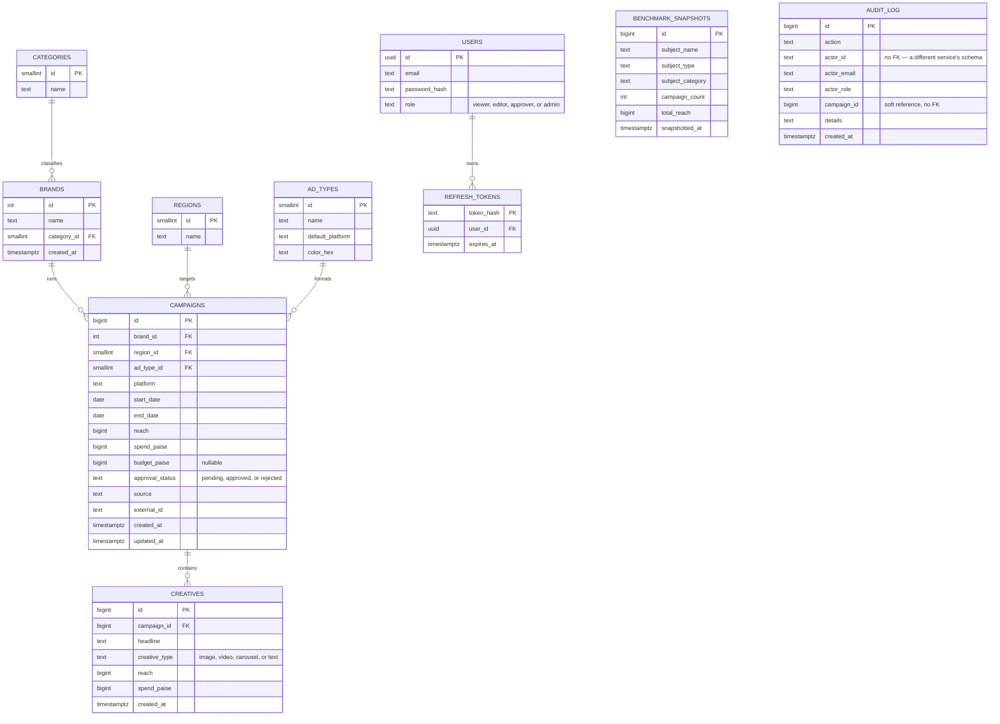

# Entity Relationship Diagram

Source of truth: [`db/schema.sql`](../db/schema.sql). Rendered with Mermaid.
The actual per-service migrations that create these tables (each qualified
to its own schema, per [`ARCHITECTURE.md`](ARCHITECTURE.md)) live in
`db/init/`: `01_catalog.sql`, `02_campaigns.sql`, `03_auth.sql` (`USERS` /
`REFRESH_TOKENS`), and `04_audit.sql` (`AUDIT_LOG`, its own schema, no FK
into any other — see `ARCHITECTURE.md`'s Audit log section for why it's
fed by NATS events, not a direct relationship).

## Notes

- **`status` ("Live" / "Completed") is not a column.** It's derived from `end_date`
  vs. the current date at read time — one less thing to keep in sync.
- **Money is stored as `spend_paise` (integer)**, never a float, to avoid rounding
  drift. The API divides by 100 before it reaches JSON.
- **`campaigns.platform` is denormalized** from `ad_types.default_platform` — most
  rows just inherit it, but a campaign can override it (e.g. a video ad
  cross-posted to a platform outside its format's default).
- **`(source, external_id)` is a partial unique index**, not a plain unique
  constraint — it only applies to ingested rows, so manually entered campaigns
  (`external_id IS NULL`) aren't forced to be unique against each other.
- **`approval_status` is a real stored column**, unlike `status` above — it's
  a decision a person makes (see `ARCHITECTURE.md`'s Campaign approval
  section), not derivable from the row's own dates. Defaults to `'approved'`
  so existing/seeded/demo-ticker rows need no backfill; only a real
  `POST /campaigns` starts a row `'pending'`. Not a visibility gate — a
  `'pending'` campaign is still fully visible everywhere.
- **`CREATIVES` is additive, not decomposed** — a campaign's own
  `reach`/`spend` are never recalculated from its creatives' sum (see
  `ARCHITECTURE.md`'s Creative-level tracking section).
- **`BENCHMARK_SNAPSHOTS` has no foreign key into `CAMPAIGNS`** — it's
  keyed by `(subject_name, subject_type)`, a subject, not one campaign,
  and it's a plain append-only fact table (no unique constraint — see
  `ARCHITECTURE.md`'s Benchmark trending section for why).
- **`AUDIT_LOG` lives in its own schema (`audit`, `db/init/04_audit.sql`),
  owned by a separate service (`audit-service`)** — `actor_id`/
  `campaign_id` are plain columns, not foreign keys, because
  `audit_service`'s Postgres role can't see `auth`'s or `campaigns`'
  schemas at all (same per-service isolation every other schema already
  has). Rows arrive from NATS events, not a direct write path.
